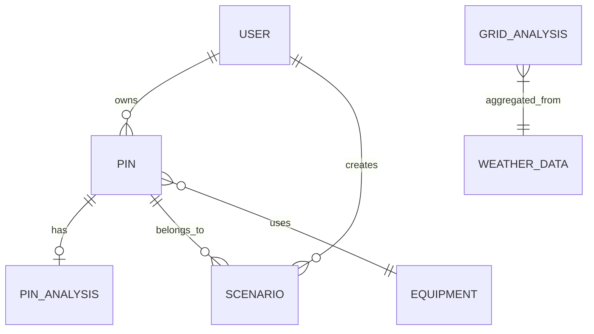

# SRRP - Proje Dokümantasyonu (Bölüm 1/2)
## Smart Renewable Resource Planner — Kapsamlı Teknik Dokümantasyon

**📌 Proje Adı:** Smart Renewable Resource Planner (SRRP)  
**📌 Versiyon:** 2.1.0  
**📌 Geliştiriciler:** Gürkan & Utku  
**📌 Son Güncelleme:** 25 Şubat 2026  
**📌 İlgili Dosya:** Devamı için → [`PROJECT_DOCUMENTATION_2.md`](PROJECT_DOCUMENTATION_2.md)

---

## 1. PROJE ÖZETİ

**SRRP**, Türkiye genelinde yenilenebilir enerji (güneş ve rüzgar) potansiyelini analiz eden, yatırım geri dönüş hesabı yapan ve optimum türbin yerleşim planlaması sunan **tam yığın (full-stack)** bir uygulamadır. 

Sistem, **Open-Meteo API**'den çekilen gerçek meteorolojik verilerle çalışır; kullanıcılar harita üzerinde pin bırakarak detaylı enerji üretim analizleri, finansal raporlar ve senaryo simülasyonları yapabilir.

### Temel Yetenekler
| # | Özellik | Açıklama |
|---|---------|----------|
| 1 | **Güneş Enerjisi Analizi** | GHI verileriyle panel üretim tahmini (aylık/yıllık) |
| 2 | **Rüzgar Enerjisi Analizi** | Türbin güç eğrisi ile üretim hesabı (kübik yasa) |
| 3 | **Coğrafi Uygunluk Kontrolü** | GIS tabanlı arazi, su, yol, eğim analizi |
| 4 | **Grid Isı Haritası** | Türkiye geneli 0.5° çözünürlüklü potansiyel haritası |
| 5 | **Rüzgar Çiftliği Optimizasyonu** | Greedy algoritma ile türbin yerleşim planı |
| 6 | **Finansal Analiz** | NPV, ROI, Geri Ödeme Süresi hesapları |
| 7 | **Senaryo Yönetimi** | Çoklu pin destekli karşılaştırmalı analiz |
| 8 | **Bölgesel Raporlama** | 7 coğrafi bölge için sıralı raporlar |
| 9 | **Gerçek Zamanlı Hava Durumu** | 81 il + ilçe bazında saatlik meteoroloji verisi |
| 10 | **IDW Enterpolasyon** | Harita renklendirmesi için spatial interpolasyon |
| 11 | **Kullanıcı Kimlik Doğrulama** | JWT + Argon2 tabanlı güvenli oturum yönetimi |
| 12 | **Tema Yönetimi** | Açık/koyu mod desteği |

---

## 2. MİMARİ GENEL BAKIŞ

### 2.1 Sistem Mimarisi

```
┌─────────────────────────────────────────────────────┐
│                    FRONTEND                          │
│              Flutter (Dart) - MVVM                   │
│                                                      │
│  ┌──────────┐  ┌──────────┐  ┌──────────┐           │
│  │Auth      │  │Map       │  │Report    │           │
│  │Screen    │  │Screen    │  │Screen    │           │
│  └────┬─────┘  └────┬─────┘  └────┬─────┘           │
│       │              │              │                │
│  ┌────┴──────────────┴──────────────┴─────┐          │
│  │         API Service Layer               │          │
│  │   (HTTP + JWT Token Management)         │          │
│  └────────────────┬───────────────────────┘          │
└───────────────────┼──────────────────────────────────┘
                    │ REST API (JSON)
┌───────────────────┼──────────────────────────────────┐
│                   ▼                                   │
│               BACKEND                                 │
│         FastAPI (Python) + Uvicorn                    │
│                                                       │
│  ┌────────────────────────────────────────┐           │
│  │           Router Layer (9 Router)       │           │
│  │  pins | users | weather | reports |     │           │
│  │  scenario | optimization | geo |        │           │
│  │  equipments | system                    │           │
│  └────────────────┬───────────────────────┘           │
│                   │                                   │
│  ┌────────────────┴───────────────────────┐           │
│  │          Service Layer (6 Servis)       │           │
│  │  solar | wind | grid | geo |            │           │
│  │  interpolation | collectors             │           │
│  └────────────────┬───────────────────────┘           │
│                   │                                   │
│  ┌────────────────┴───────────────────────┐           │
│  │         Database Layer (3 SQLite)       │           │
│  │  system_data.db | user_data.db |        │           │
│  │  user_pins_data.db                      │           │
│  └────────────────────────────────────────┘           │
└───────────────────────────────────────────────────────┘
                    │
                    ▼ (Dış API Çağrıları)
          ┌──────────────────┐
          │   Open-Meteo API  │
          │  (Meteoroloji)    │
          └──────────────────┘
```

### 2.2 Teknoloji Yığını

| Katman | Teknoloji | Versiyon |
|--------|-----------|----------|
| **Frontend** | Flutter (Dart) | SDK ^3.8.1 |
| **Harita** | flutter_map + Leaflet Tiles | ^8.2.2 |
| **Grafikler** | fl_chart | ^1.1.0 |
| **State Yönetimi** | Provider (MVVM) | ^6.1.5 |
| **Backend** | FastAPI + Uvicorn | 2.1.0 |
| **ORM** | SQLAlchemy | - |
| **Veritabanı** | SQLite (3 ayrı DB) | - |
| **Kimlik Doğrulama** | JWT (python-jose) + Argon2 (passlib) | - |
| **Geospatial** | GeoPandas, Rasterio, Shapely | - |
| **Numerik** | NumPy, SciPy, Pandas, scikit-learn | - |
| **Meteoroloji API** | Open-Meteo (Archive + Forecast) | - |
| **Migration** | Alembic | - |

---

## 3. VERİTABANI MİMARİSİ

Sistem **3 ayrı SQLite veritabanı** kullanır. Bu ayrım, büyük sistem verilerinin (300+ MB) kullanıcı verilerinden izole edilmesini sağlar.

### 3.1 system_data.db (~330 MB)
Uygulama genelinde paylaşılan sabit ve hesaplanmış veriler.

| Tablo | Açıklama | Alanlar |
|-------|----------|---------|
| `equipments` | Türbin ve panel ekipman kataloğu | `id`, `name`, `type`, `rated_power_kw`, `efficiency`, `specs` (JSON), `cost_per_unit`, `maintenance_cost_annual` |
| `grid_analyses` | Türkiye grid potansiyel haritası (0.5° çözünürlük) | `id`, `latitude`, `longitude`, `type` (Solar/Wind), `annual_potential_kwh_m2`, `avg_wind_speed_ms`, `logistics_score`, `predicted_monthly_data` (JSON), `overall_score` |
| `weather_data` | Günlük grid hava durumu verisi (2015-2025) | `id`, `latitude`, `longitude`, `date`, `shortwave_radiation_sum`, `wind_speed_mean`, `wind_speed_max`, `wind_direction_dominant`, `temperature_mean` |
| `hourly_weather_data` | 81 il + ilçe bazında saatlik meteoroloji | `id`, `city_name`, `district_name`, `latitude`, `longitude`, `timestamp`, `temperature_2m`, `apparent_temperature`, `wind_speed_10m`, `wind_speed_100m`, `shortwave_radiation`, `direct_radiation`, `diffuse_radiation`, `relative_humidity_2m`, `cloud_cover`, `precipitation` |
| `legacy_solar_panels` | Eski uyumluluk tablosu | `id`, `model_name`, `is_default` |
| `legacy_turbines` | Eski uyumluluk tablosu | `id`, `model_name`, `is_default` |

### 3.2 user_data.db
Kullanıcı hesapları ve oluşturdukları dinamik içerikler.

| Tablo | Açıklama | İlişkiler |
|-------|----------|-----------|
| `users` | Kullanıcı hesapları (`email`, `hashed_password`, `is_active`, `created_at`) | 1:N → `pins`, 1:N → `scenarios` |
| `pins` | Harita iğneleri (`latitude`, `longitude`, `type`, `capacity_mw`, `panel_area`, `equipment_id`) | N:1 → `users`, 1:1 → `pin_analyses`, 1:N → `scenarios` |
| `pin_analyses` | Pin analiz sonuçları (`result_data` JSON) | 1:1 → `pins` |
| `scenarios` | Senaryo kayıtları (`name`, `pin_ids` JSON, `result_data` JSON, `start_date`, `end_date`) | N:1 → `users`, N:1 → `pins` |

### 3.3 user_pins_data.db
Kullanıcı pin hesaplama sonuçlarının ayrıntılı deposu.

| Tablo | Açıklama |
|-------|----------|
| `pin_calculation_results` | `pin_id`, `latitude`, `longitude`, `calculated_at`, `annual_total_energy_kwh`, `capacity_factor`, `avg_wind_speed`, `avg_solar_irradiance`, `avg_temperature`, `monthly_data` (JSON) |

### 3.4 Veritabanı İlişki Diyagramı



---

## 4. BACKEND MİMARİSİ

### 4.1 Uygulama Yaşam Döngüsü (`main.py`)

Backend başlatıldığında 4 arka plan görevi otomatik çalışır:

```
🚀 Backend Başlatılıyor...
  ├─ 1. 📅 Günlük Veri Güncelleyici    → Eksik günleri Open-Meteo'dan doldurur
  ├─ 2. ⏱️ Saatlik Veri Güncelleyici   → 81 il saatlik hava durumu
  ├─ 3. 🗺️ Grid Analiz Servisi        → Local DB'den grid aggregation
  └─ 4. ⏰ Zamanlayıcı                 → Her 1 saatte saatlik güncelleme tekrarı
```

### 4.2 Kimlik Doğrulama Sistemi (`auth.py`)

| Bileşen | Detay |
|---------|-------|
| **Şifreleme** | Argon2 (passlib) — Memory-hard algoritma |
| **Token** | JWT (python-jose) — HS256 algoritması |
| **Token Süresi** | 30 dakika (`.env`'den yapılandırılabilir) |
| **Koruma** | OAuth2PasswordBearer — Bearer token şeması |
| **Konfigürasyon** | `SECRET_KEY`, `ALGORITHM`, `ACCESS_TOKEN_EXPIRE_MINUTES` → `.env` |

**Güvenlik İlkeleri:**
- User Enumeration koruması (aynı hata mesajı)
- Zero Trust: Tüm yazma işlemleri token gerektirir
- Geçersiz koordinat koruması (Pydantic validator, lat ≤ 90)

### 4.3 Router Katmanı (API Endpoint'leri)

#### 4.3.1 Pins Router (`/pins/`)
Harita iğnelerinin CRUD işlemleri ve enerji potansiyel hesapları.

| Method | Endpoint | Açıklama |
|--------|----------|----------|
| `POST` | `/pins/` | Yeni pin oluştur (otomatik analiz ile) |
| `GET` | `/pins/` | Kullanıcının tüm pinlerini listele |
| `PUT` | `/pins/{id}` | Pin güncelle |
| `DELETE` | `/pins/{id}` | Pin sil (cascade delete ile) |
| `POST` | `/pins/calculate` | Anlık hesaplama (kaydetmeden) |
| `POST` | `/pins/{id}/analyze` | Mevcut pin için detaylı analiz çalıştır ve kaydet |
| `GET` | `/pins/grid-map` | Grid harita verisi (Solar/Wind) |

**Hesaplama Mantığı (Pin Analiz):**
1. WeatherData tablosundan yıllık/aylık ortalamalar çekilir
2. Pin tipine göre `solar_service` veya `wind_service` çağrılır
3. Üzerine `calculate_financials()` ile yatırım analizi eklenir
4. Sonuç `PinAnalysis` tablosuna JSON olarak kaydedilir

#### 4.3.2 Weather Router (`/weather/`)
81 il ve ilçeler için saatlik hava durumu verileri.

| Method | Endpoint | Açıklama |
|--------|----------|----------|
| `GET` | `/weather/cities` | Tüm şehirlerin koordinat listesi |
| `GET` | `/weather/{city}/hourly` | Şehir bazlı saatlik veri (max 720 saat) |
| `GET` | `/weather/{city}/latest` | En güncel veri |
| `GET` | `/weather/summary` | Tüm şehirler için özet istatistikler |
| `GET` | `/weather/best-wind` | En iyi rüzgar potansiyeli (Top N) |
| `GET` | `/weather/best-solar` | En iyi güneş potansiyeli (Top N) |
| `GET` | `/weather/at-time` | Belirli zaman dilimi verisi |
| `POST` | `/weather/refresh` | Manuel yenileme (admin) |

#### 4.3.3 Reports Router (`/reports/`)
Bölgesel enerji potansiyel raporları ve enterpolasyon haritası.

| Method | Endpoint | Açıklama |
|--------|----------|----------|
| `GET` | `/reports/regional` | Bölgesel rapor (Solar/Wind, Yıllık/Aylık/Anlık) |
| `GET` | `/reports/interpolated-map` | IDW enterpolasyon harita verisi |

**Desteklenen Bölgeler:** Marmara, Ege, Akdeniz, Karadeniz, İç Anadolu, Doğu Anadolu, Güneydoğu Anadolu, "Tümü"

**Rapor Zaman Aralıkları:**
- **Yıllık:** Son 1 yılın ortalama potansiyeli
- **Aylık:** Son 30 gunun ortalaması
- **Anlık:** Son 24 saatlik veriler

#### 4.3.4 Scenario Router (`/scenarios/`)
Çoklu pin destekli senaryo yönetimi.

| Method | Endpoint | Açıklama |
|--------|----------|----------|
| `POST` | `/scenarios/` | Yeni senaryo oluştur (birden fazla pin desteği) |
| `GET` | `/scenarios/` | Kullanıcı senaryolarını listele |
| `PUT` | `/scenarios/{id}` | Senaryo güncelle |
| `POST` | `/scenarios/{id}/calculate` | Senaryo hesaplaması çalıştır |
| `POST` | `/scenarios/{id}/add-pins` | Mevcut senaryoya pin ekle |

**Senaryo Hesaplama Süreci:**
1. Senaryodaki tüm pin'ler üzerinde döngü
2. Her pin için meteorolojik veri çekilir
3. Pin tipine göre güneş/rüzgar üretim hesabı
4. Finansal analiz (NPV, ROI, Geri Ödeme Süresi)
5. Sonuçlar birleştirilerek `result_data`'ya JSON olarak kaydedilir

#### 4.3.5 Optimization Router (`/optimization/`)
Seçilen alan için optimum türbin yerleşimi.

| Method | Endpoint | Açıklama |
|--------|----------|----------|
| `POST` | `/optimization/wind-placement` | Rüzgar çiftliği yerleşim optimizasyonu |

**Optimizasyon Algoritması (Greedy Placement):**
1. Seçilen bounding box'taki `GridAnalysis` verileri çekilir
2. Rüzgar hızına göre puanlanır ve sıralanır
3. En yüksek puanlı noktadan başlanarak türbinler yerleştirilir
4. Her yerleştirmede minimum mesafe kısıtı kontrol edilir (varsayılan: rotor çapı × 5)
5. Maksimum 50 türbin yerleştirilebilir (sunucu güvenliği)

#### 4.3.6 Geo Router (`/geo/`)
Coğrafi uygunluk analizi (GIS).

| Method | Endpoint | Açıklama |
|--------|----------|----------|
| `POST` | `/geo/check-suitability` | Koordinat uygunluk kontrolü |

**GeoService Analiz Kriterleri:**
- 🌊 Su kütlesine yakınlık (göl, nehir)
- 🏗️ Bina ve yapılara mesafe
- 🛤️ Demiryolu ve altyapıya yakınlık
- ⛰️ Arazi eğimi (DEM verisinden)
- 🗺️ Il/İlçe sınır tespiti (Shapefile)

#### 4.3.7 Users Router (`/users/`)

| Method | Endpoint | Açıklama |
|--------|----------|----------|
| `POST` | `/users/` | Yeni kullanıcı kaydı |
| `POST` | `/users/token` | JWT token alma (login) |
| `GET` | `/users/me` | Mevcut kullanıcı bilgisi |

#### 4.3.8 Equipments Router (`/equipments/`)

| Method | Endpoint | Açıklama |
|--------|----------|----------|
| `GET` | `/equipments/` | Ekipman kataloğu listesi |
| `POST` | `/equipments/` | Yeni ekipman ekle |

#### 4.3.9 System Router (`/system/`)

| Method | Endpoint | Açıklama |
|--------|----------|----------|
| `GET` | `/system/health` | Sistem sağlık kontrolü |

---

## 5. SERVİS KATMANI (İş Mantığı)

### 5.1 Solar Service (`solar_service.py`)

**Güneş enerjisi üretim hesaplama motoru.**

**Fiziksel Formül:**
```
E = A × r × H × PR
```
- `A` — Panel alanı (m²)
- `r` — Panel verimi (varsayılan: 0.20 = %20)
- `H` — Günlük ortalama GHI (kWh/m²)
- `PR` — Performans Oranı (0.80; sıcaklık, kablo, inverter kayıpları)

**Veri Kaynakları:**
- **Birincil:** Yerel `WeatherData` tablosundan yıllık/aylık `shortwave_radiation_sum`
- **Yedek (Fallback):** Enlem bazlı tahmin: `GHI ≈ 5.5 - (enlem - 36) × 0.2`
- **Saatlik Arşiv:** Open-Meteo Archive API'den son 1 yıllık saatlik veri

**Çıktılar:**
- `daily_avg_potential_kwh_m2` — Günlük ortalama potansiyel
- `predicted_annual_production_kwh` — Yıllık toplam üretim
- `month_by_month_prediction` — 12 aylık üretim dağılımı (Ocak-Aralık)

### 5.2 Wind Service (`wind_service.py`)

**Rüzgar enerjisi üretim hesaplama motoru.**

**Türbin Güç Eğrisi (3.3 MW referans):**
```
Rüzgar Hızı (m/s)  →  Güç (kW)
0-2                 →  0
3                   →  50
5                   →  350
8                   →  1400
10                  →  2300
12                  →  3000
14-25               →  3300 (rated)
>25                 →  0 (cut-out)
```

**Hesaplama Adımları:**
1. Ortalama rüzgar hızını belirle (DB veya fallback: 6.0 m/s)
2. Güç eğrisinden lineer interpolasyon ile base güç hesapla
3. Variability Factor ile düzeltme uygula (8 m/s altında: ×1.6, üstünde: ×1.2)
4. Yıllık enerji = düzeltilmiş güç × 8760 saat
5. Capacity Factor = yıllık üretim / (rated güç × 8760), max %55

**Çıktılar:**
- `avg_wind_speed_ms` — Ortalama rüzgar hızı
- `predicted_annual_production_kwh` — Yıllık toplam üretim
- `capacity_factor` — Kapasite faktörü

### 5.3 Grid Service (`grid_service.py`)

**Türkiye geneli grid potansiyel analizi servisi.**

**Kapsam:**
- Enlem: 35.5° – 42.5° (Güney Hatay → Kuzey Sinop)
- Boylam: 25.5° – 45.0° (Batı Edirne → Doğu Iğdır)
- Çözünürlük: 0.5° (~55 km)

**İki Analiz Modu:**
1. **`perform_grid_analysis`:** Dış API'den (Open-Meteo) veri çekerek grid oluşturma
2. **`calculate_and_update_from_local_db`:** Yerel `HourlyWeatherData`'dan aggregation

**Puanlama Sistemi (Overall Score):**
- Rüzgar: `(wind_speed / 15) × 50 + logistics_score × 50`
- Güneş: `(solar_radiation / max_radiation) × 50 + logistics_score × 50`
- Logistics Score: Merkez enlemden (~39°) uzaklığa bağlı simüle edilmiş lojistik puanı

### 5.4 Geo Service (`geo_service.py`)

**GIS tabanlı coğrafi analiz servisi.**

**Kullandığı Veri Kaynakları (Shapefile):**
- `country_border` — Türkiye sınırı (noktanın Türkiye içinde olup olmadığı)
- `provinces_gdf` — İl sınırları
- `districts_gdf` — İlçe sınırları
- `water_gdf` — Su kütleleri (göl, nehir, baraj)
- `railways_gdf` — Demiryolları
- `buildings_gdf` — Yerleşim alanları
- `roads_gdf` — Karayolları
- `landuse_gdf` — Arazi kullanım verileri
- DEM (Digital Elevation Model) — Yükseklik ve eğim verileri (Rasterio)

**Analiz Çıktıları:**
- `solar_suitable` — Güneş enerjisine uygun mu?
- `wind_suitable` — Rüzgar enerjisine uygun mu?
- `solar_reasons` / `wind_reasons` — Uygunluk/uygunsuzluk nedenleri
- `solar_notes` / `wind_notes` — Ek notlar
- `location_info` — İl, İlçe bilgisi
- `elevation` — Rakım (m)
- `slope` — Eğim (°)

### 5.5 Interpolation Service (`interpolation_service.py`)

**IDW (Inverse Distance Weighting) uzaysal enterpolasyon.**

**Amaç:** Dağınık veri noktalarını (şehir/grid verisi) düzenli bir ızgaraya dönüştürüp harita renklendirmesi sağlamak.

**Parametreler:**
- Çözünürlük: 0.1° (~11 km)
- IDW Power: 2.0 (dengeli bulanıklık)
- Kapsam: 35.8°–42.2° enlem, 25.5°–45.0° boylam (tüm Türkiye)

**Algoritma:** `u(x) = Σ(wᵢ × uᵢ) / Σ(wᵢ)`, burada `wᵢ = 1 / dⁱᵖ`

### 5.6 Data Collectors (Veri Toplama Servisleri)

#### 5.6.1 Historical Collector (`collectors/historical.py`)
Geçmiş meteorolojik verilerin toplu çekimi.

| Parametre | Değer |
|-----------|-------|
| **Kaynak** | Open-Meteo Archive API |
| **Zaman Aralığı** | 2015 — 2025 (10 yıl) |
| **Grid Çözünürlüğü** | 0.5° (Türkiye geneli) |
| **Batch Boyutu** | 10 nokta / istek |
| **Toplanan Veriler** | shortwave_radiation_sum, wind_speed_mean, wind_speed_max, wind_direction_dominant, temperature_mean |

**Fonksiyonlar:**
- `fetch_historical_grid_data()` → 10 yıllık toplu veri çekimi
- `update_daily_grid_data()` → Eksik günleri tespit edip doldurma (startup'ta çalışır)

#### 5.6.2 Hourly Collector (`collectors/hourly.py`)
81 il ve ilçeler için saatlik canlı veri toplama.

| Parametre | Değer |
|-----------|-------|
| **Kaynak** | Open-Meteo Forecast API |
| **Güncelleme Sıklığı** | Her 1 saat (otomatik scheduler) |
| **Varsayılan Aralık** | Son 7 gün (168 saat) |
| **Batch Boyutu** | 10 şehir / istek |
| **Batch Arası Bekleme** | 1 saniye |

**Toplanan Saatlik Veriler:**
- `temperature_2m`, `apparent_temperature`
- `wind_speed_10m`, `wind_speed_100m`, `wind_direction_10m`, `wind_gusts_10m`
- `shortwave_radiation`, `direct_radiation`, `diffuse_radiation`
- `relative_humidity_2m`, `cloud_cover`, `precipitation`

---

## 6. FİNANSAL HESAPLAMA MODELİ

### 6.1 Finansal Analiz Çıktıları

```python
class FinancialAnalysis:
    initial_investment_usd: float   # Toplam yatırım maliyeti ($)
    annual_earnings_usd: float      # Yıllık kazanç ($)
    payback_period_years: float     # Geri ödeme süresi (yıl)
    roi_percentage: float           # Yatırım Getirisi (%)
```

### 6.2 Desteklenen Hesaplamalar

| Hesaplama | Formül | Açıklama |
|-----------|--------|----------|
| **Geri Ödeme** | `Yatırım / Yıllık Kazanç` | Sıfır kazançta "Infinity" döner |
| **ROI** | `(Kazanç - Maliyet) / Maliyet × 100` | % cinsinden getiri |
| **NPV (Net Bugünkü Değer)** | `PV = FV / (1+r)^t` | Zaman değerini hesaba katar |
| **Kapasite Faktörü** | `Üretim / (Rated × 8760)` | Gerçek/teorik üretim oranı |

### 6.3 Matematiksel Güvenlik
- **Sıfıra bölme koruması:** Yıllık tasarruf = 0 olduğunda geri ödeme süresi `Infinity` döner
- **Kapasite faktörü sınırı:** Rüzgar CF'si %55'i aşamaz (gerçekçilik kısıtı)
- **Solar verim sınırsız:** Teorik teknolojileri modellemek için verim üst sınırı yoktur

---

*→ Devamı [`PROJECT_DOCUMENTATION_2.md`](PROJECT_DOCUMENTATION_2.md) dosyasında.*  
*(Frontend Mimarisi, Ekranlar, Widget'lar, Test Stratejisi, Kurulum, API Referansı)*
