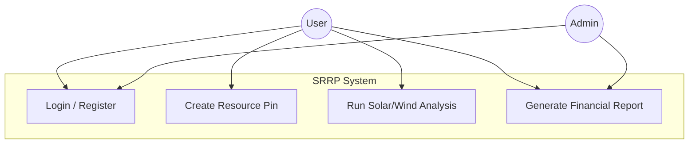
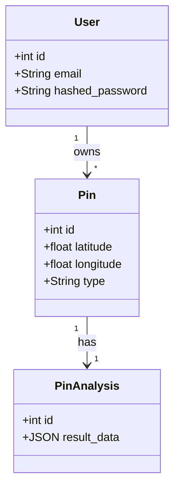

# SRRP Final Technical Report (Draft Structure)

[Sections 1-5: Introduction, Scope, Methodology - Missing / To Be Added]

## 6. RISK MANAGEMENT

| WP | Risks | Risk Management (Plan B) |
| :--- | :--- | :--- |
| **WP1** | **API Limitations** (Open-Meteo downtime or rate limits) | Implement local caching for weather data to reduce API calls. Switch to NASA Power API as a fallback source. |
| **WP2** | **Complexity of mathematical models** (Accuracy issues) | Validate calculated data against known PVGIS datasets. If discrepancies exist, introduce a simple correction factor. |
| **WP3** | **Database Migration conflicts** | Use a separate `test_db` for development. Create strict backup routines before applying Alembic migrations. |
| **WP4** | **Team collaboration issues** (Merge conflicts) | Enforce "Feature Branch" workflow in Git. Require Pull Request reviews before merging to main. |

## 7. PROJECT SCHEDULE AND TASK SHARING

| WP No | Work Package Name | Assigned Project Staff | Time Period | Success Criteria |
| :--- | :--- | :--- | :--- | :--- |
| **1** | Requirement Analysis & Tech Selection | Utku, Gürkan | Week 1-2 | SRS Document completed. Stack defined. |
| **2** | Database Design & ORM Implementation | Utku | Week 3-4 | DB Schema verified. |
| **3** | API & Auth Module Development | Gürkan | Week 4-5 | JWT Login working. |
| **4** | Solar & Wind Calculation Logic | Gürkan | Week 6-7 | Accurate outputs from calculation modules. |
| **5** | CRUD Operations for Resources | Gürkan | Week 7-8 | Create/Read/Update/Delete Pins working. |
| **6** | Frontend Integration (Web & Mobile) | Utku, Gürkan | Week 9 | Next.js and Flutter clients consuming API. |

## 8. SYSTEM REQUIREMENTS ANALYSIS

### a. Use Case Model
<!-- Placeholder for Mermaid Diagram -->

### b. Object Model
<!-- Placeholder for Mermaid Diagram -->

[Sections 9: Implementation Details - To Be Added]

## 10. SYSTEM VERIFICATION (TESTING)
*Refer to `TESTING_STRATEGY.md` for the full content of this section.*

## 11. DISCUSSION OF THE RESULTS
*Refer to `DISCUSSION_OF_RESULTS.md` for the full content of this section.*

## 12. REFERENCES

1.  **FastAPI Documentation**. https://fastapi.tiangolo.com/
2.  **Open-Meteo API Docs**. https://open-meteo.com/en/docs
3.  **IEC 61400-12-1:2017**, *Wind energy generation systems - Power performance measurements of electricity producing wind turbines.*
4.  Fielding, R. T. (2000). *Architectural Styles and the Design of Network-based Software Architectures.*
5.  **Flutter Documentation**. Google Developers. https://flutter.dev/docs
6.  Merkel, D. (2014). *Docker: lightweight linux containers for consistent development and deployment.* Linux Journal.
7.  **PostgreSQL Documentation**. https://www.postgresql.org/docs/
8.  **SQLAlchemy 2.0 Documentation**. https://docs.sqlalchemy.org/
